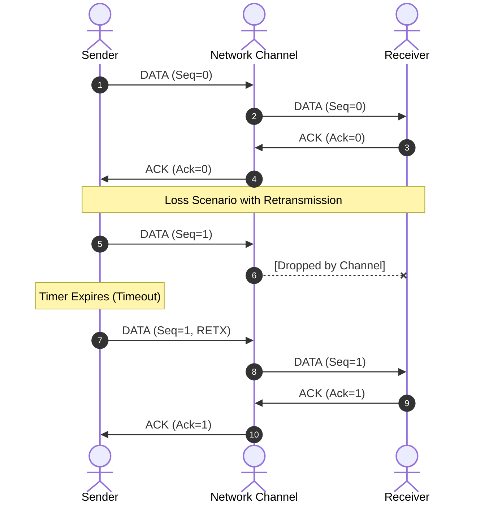
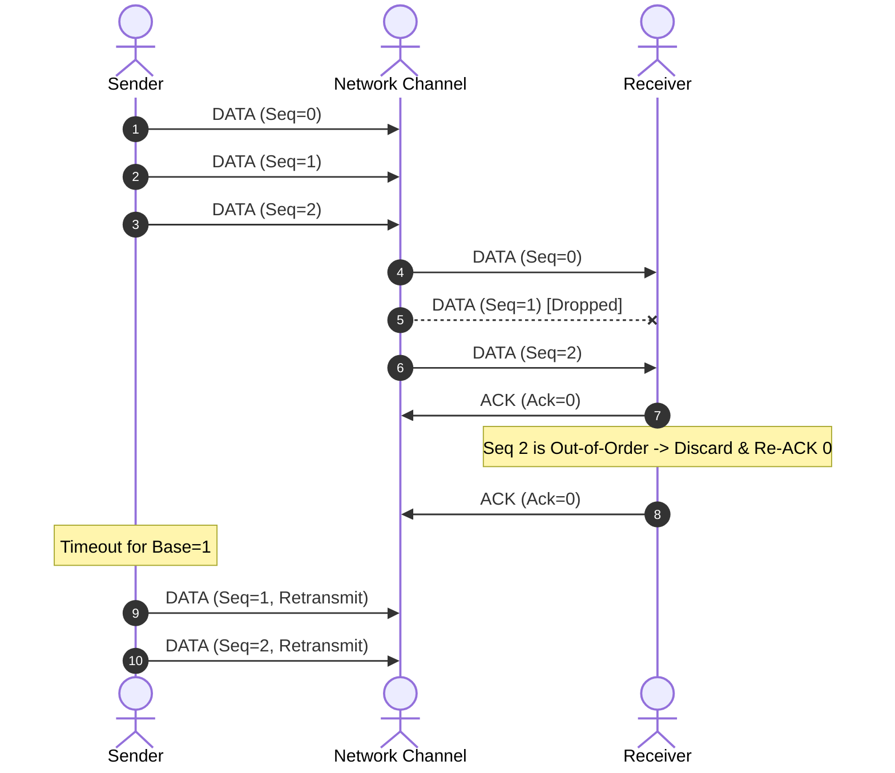
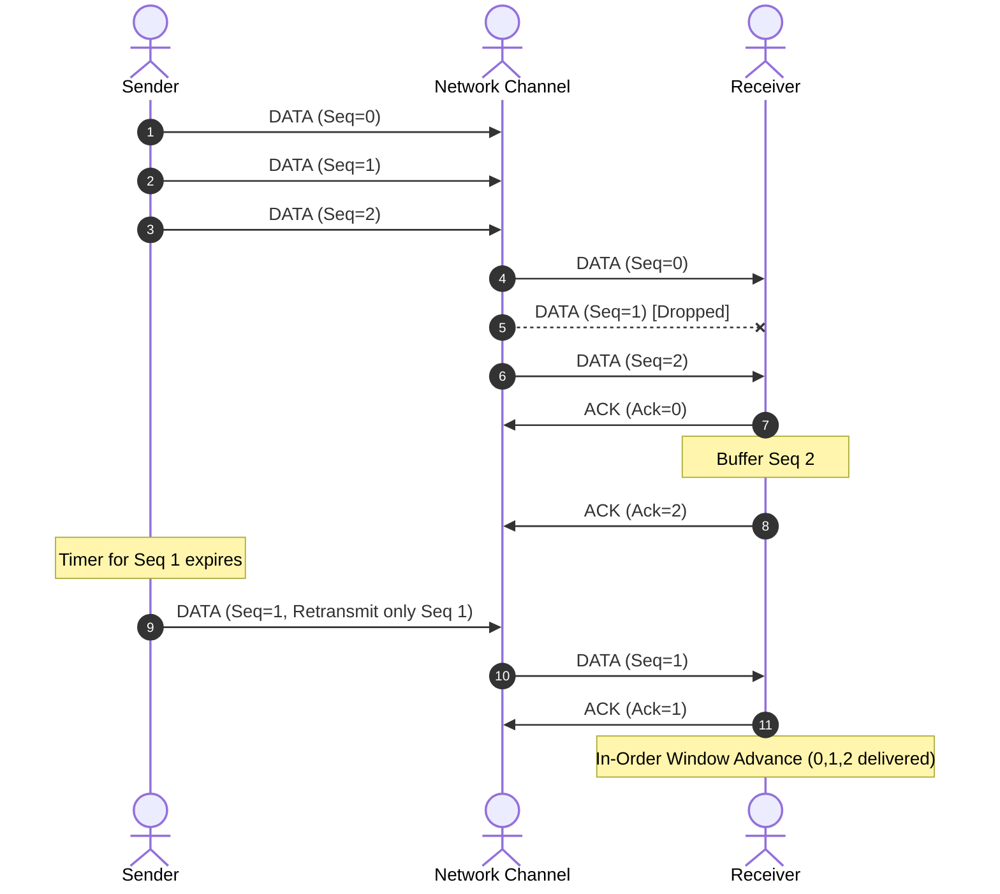

# 📡 Reliable UDP Lab (RUDP)
### Custom Reliable Data Transfer (RDT) Protocol Engine & Live Visualizer

A complete Computer Networks laboratory project implementing reliable end-to-end transport protocols (Stop-and-Wait, Go-Back-N, Selective Repeat) strictly over raw UDP sockets (`socket.AF_INET, socket.SOCK_DGRAM`), backed by a network impairment simulator, adaptive RTO calculation, and a real-time reactive React dashboard.

---

## 📑 Table of Contents
1. [Architecture Overview](#-architecture-overview)
2. [Protocol Specification](#-protocol-specification)
3. [ARQ Mechanisms](#-arq-mechanisms)
   - [Stop-and-Wait (SAW)](#1-stop-and-wait-saw)
   - [Go-Back-N (GBN)](#2-go-back-n-gbn)
   - [Selective Repeat (SR)](#3-selective-repeat-sr)
4. [Adaptive RTO (Jacobson & Karn)](#-adaptive-rto-estimation)
5. [Network Impairment Simulator](#-network-impairment-simulator)
6. [Quickstart & How to Run](#-quickstart--how-to-run)
7. [CLI Usage Guide](#-cli-usage-guide)
8. [Automated Benchmark Experiments](#-automated-benchmark-experiments)
9. [Comprehensive Viva & Oral Exam Q&A](#-comprehensive-viva--oral-exam-qa)

---

## 🏗 Architecture Overview

The system strictly decouples the **UDP data path** from the **WebSocket monitoring telemetry**:

```
[CLI / Web SENDER] (Port: Dynamic)
       │
       │ Raw UDP Packets (DATA / START / END / PING)
       ▼
┌─────────────────────────────────────────────────────────────┐
│               NETWORK CHANNEL SIMULATOR                     │
│               UDP Proxy on Port 9000                        │
│   • Loss Probability Drop                                   │
│   • Bit-Corruption Injection                                │
│   • Gaussian Latency & Jitter Delay Queue                   │
│   • Duplicate Generation & Packet Reordering                │
└─────────────────────────────────────────────────────────────┘
       │                                     ▲
       │ Forwarded Data Packets              │ ACKs Forwarded Back
       ▼                                     │
[CLI / Web RECEIVER] (Port 9001) ────────────┘
       │
       ▼ (SHA-256 Integrity Verification)
[Received File in output_files/]

═══════════════════════════════════════════════════════════════════
                      TELEMETRY PIPELINE
 Sender & Receiver  ──►  Thread-Safe EventBus  ──►  FastAPI WebSocket
                                                           │
                                                           ▼
                                                [React 18 Dashboard]
```

---

## 📦 Protocol Specification

### Packet Header Layout (20 Bytes Packed Binary)

All packets transmitted over the UDP socket share a fixed 20-byte binary header formatted using Python's `struct` format `!B I I I H B I`:

```
 0                   1                   2                   3
 0 1 2 3 4 5 6 7 8 9 0 1 2 3 4 5 6 7 8 9 0 1 2 3 4 5 6 7 8 9 0 1
+-+-+-+-+-+-+-+-+-+-+-+-+-+-+-+-+-+-+-+-+-+-+-+-+-+-+-+-+-+-+-+-+
|  Packet Type  |                Sequence Number                |
+-+-+-+-+-+-+-+-+-+-+-+-+-+-+-+-+-+-+-+-+-+-+-+-+-+-+-+-+-+-+-+-+
|                          Ack Number                           |
+-+-+-+-+-+-+-+-+-+-+-+-+-+-+-+-+-+-+-+-+-+-+-+-+-+-+-+-+-+-+-+-+
|                           Timestamp                           |
+-+-+-+-+-+-+-+-+-+-+-+-+-+-+-+-+-+-+-+-+-+-+-+-+-+-+-+-+-+-+-+-+
|        Payload Length         |     Flags     |               |
+-+-+-+-+-+-+-+-+-+-+-+-+-+-+-+-+-+-+-+-+-+-+-+-+               +
|                        CRC32 Checksum                         |
+-+-+-+-+-+-+-+-+-+-+-+-+-+-+-+-+-+-+-+-+-+-+-+-+-+-+-+-+-+-+-+-+
|                                                               |
|                        Payload Data ...                       |
|                                                               |
+-+-+-+-+-+-+-+-+-+-+-+-+-+-+-+-+-+-+-+-+-+-+-+-+-+-+-+-+-+-+-+-+
```

### Field Breakdown

| Field | Type | Size | Description |
|---|---|---|---|
| `packet_type` | `uint8` | 1 byte | Enum: `0=START`, `1=DATA`, `2=ACK`, `3=NAK`, `4=END`, `5=PING`, `6=PONG` |
| `seq_num` | `uint32` | 4 bytes | 0-indexed packet sequence number |
| `ack_num` | `uint32` | 4 bytes | Acknowledged sequence number |
| `timestamp` | `uint32` | 4 bytes | Transmission timestamp in milliseconds |
| `length` | `uint16` | 2 bytes | Byte length of following payload (0 to 65535) |
| `flags` | `uint8` | 1 byte | Bitmask: `0x01=SYN`, `0x02=FIN`, `0x04=RST`, `0x08=RETX` |
| `checksum` | `uint32` | 4 bytes | IEEE 802.3 32-bit CRC over header (with checksum=0) + payload |
| `payload` | `bytes` | Variable | Raw file chunk or metadata bytes |

---

## 🔁 ARQ Mechanisms

### 1. Stop-and-Wait (SAW)
- **Sender**: Sends one packet and blocks until a valid matching ACK arrives. If a timeout occurs, the packet is retransmitted.
- **Receiver**: Accepts sequence numbers matching expected parity (`seq_num == expected_seq`). Discards corrupt packets and duplicate sequence numbers (re-ACKing the previous packet).
- **Theoretical Efficiency**: $\eta = \frac{T_{trans}}{T_{trans} + 2 \cdot T_{prop} + T_{proc}}$



---

### 2. Go-Back-N (GBN)
- **Pipelining**: Allows up to $N$ unacknowledged packets in flight (`[send_base, send_base + N - 1]`).
- **Cumulative ACKs**: `ACK(k)` confirms all packets up to and including $k$.
- **Timer**: A single timer associated with the oldest unacknowledged packet (`send_base`).
- **On Timeout**: The sender retransmits **all** unacknowledged packets currently in the window (`send_base` through `next_seq_num - 1`).
- **Receiver**: Accepts strictly in-order packets. Discards out-of-order packets and re-sends ACK for the highest consecutively received packet.



---

### 3. Selective Repeat (SR)
- **Individual ACKs**: Receiver independently ACKs every correctly received packet, buffering out-of-order packets.
- **Per-Packet Timers**: Sender maintains independent timers for each unacknowledged packet in flight.
- **Selective Retransmission**: On timeout, only the specific unacknowledged packet is resent.
- **Window Condition**: Window size $N$ must satisfy $N \le 2^{(k-1)}$ to prevent ambiguous sequence number overlap with the receiver window.



---

## ⏱ Adaptive RTO Estimation

The protocol employs **Jacobson's Algorithm** (RFC 6298) with **Karn's Algorithm** for dynamic timeout calculation:

$$\text{Err} = \text{SampleRTT} - \text{SRTT}$$
$$\text{SRTT} \leftarrow \text{SRTT} + \alpha \cdot \text{Err} \quad (\alpha = 0.125)$$
$$\text{RTTVAR} \leftarrow \text{RTTVAR} + \beta \cdot (|\text{Err}| - \text{RTTVAR}) \quad (\beta = 0.25)$$
$$\text{RTO} = \text{SRTT} + 4 \cdot \text{RTTVAR}$$

### Karn's Algorithm
1. Do **not** update RTT estimates based on ACKs for retransmitted packets (eliminates retransmission ambiguity).
2. Apply **Exponential Backoff** ($RTO \leftarrow RTO \times 2$) on every consecutive retransmission timeout up to `max_rto` (default 5.0s).

---

## 🌪 Network Impairment Simulator

The UDP proxy (`backend/protocol/channel.py`) intercepts both forward data and backward ACK packets:
- **Packet Loss**: Bernoulli random trial against `loss_rate`.
- **Packet Corruption**: Random bit-flip in payload/header against `corruption_rate`.
- **Latency & Jitter**: Delays packet forwarding using an asynchronous worker queue: $T_{delay} = \text{delay} + \mathcal{N}(0, \text{jitter}^2)$.
- **Duplication**: Replicates packets with configurable probability.
- **Reordering**: Induces shuffle through asymmetric jitter queuing.

### Built-in Presets
| Preset | Loss | Corruption | Delay | Jitter |
|---|---|---|---|---|
| **LAN** | 0% | 0% | 1ms | 0.5ms |
| **Wi-Fi (Normal)** | 2% | 0.5% | 15ms | 5ms |
| **Poor Wireless** | 10% | 3% | 100ms | 30ms |
| **Satellite Link** | 1% | 0.1% | 600ms | 50ms |

---

## 🚀 Quickstart & How to Run

### Prerequisites
- Python 3.10+
- Node.js 18+

### 1. Start the Backend API & Protocol Engine
```bash
cd backend
pip install -r requirements.txt
python -m uvicorn main:app --reload --port 8000
```
*API Swagger Docs available at `http://localhost:8000/docs`*

### 2. Start the React Frontend Dashboard
```bash
cd frontend
npm install
npm run dev
```
*Dashboard running at `http://localhost:5173`*

### 3. Run Backend Test Suite
```bash
pytest -v
```
*(All 36 protocol unit, integration, and channel tests pass).*

---

## 💻 CLI Usage Guide

You can run full transfers entirely via command line without the web dashboard:

### Terminal 1: Start Channel Proxy
```bash
python -c "import asyncio; from protocol.channel import NetworkChannel, PRESETS; channel=NetworkChannel(listen_port=9000, receiver_addr=('127.0.0.1', 9001), config=PRESETS['POOR']); asyncio.run(channel.start())"
```

### Terminal 2: Start Receiver
```bash
python -m backend.cli.receive --protocol gbn --port 9001 --output received_output.bin
```

### Terminal 3: Start Sender
```bash
python -m backend.cli.send --protocol gbn --file test_files/sample.pdf --host 127.0.0.1 --port 9000 --window-size 8 --packet-size 1024
```

---

## 📊 Automated Benchmark Experiments

The laboratory suite includes an automated multi-trial experiment runner (`backend/services/experiments.py`):
- **Loss Sweep**: Compares throughput (KB/s) and efficiency across loss rates 0% → 30%.
- **Delay Sweep**: Evaluates protocol degradation from 5ms → 500ms RTT.
- **Packet Size Sweep**: Analyzes header overhead vs. fragmentation tradeoff (256B → 8192B).
- **Corruption Sweep**: Compares CRC32 rejection rate across 0% → 10% corruption.
- **Protocol Comparison**: Direct head-to-head benchmarking of SAW, GBN, and SR.

All results exportable to CSV directly from the frontend or API.

---

## 🎓 Comprehensive Viva & Oral Exam Q&A

### Q1: Why use UDP instead of raw IP or TCP?
**A:** Raw IP lacks port multiplexing and requires root/administrator privileges. TCP already implements reliability in the kernel, making it impossible to observe or control custom ARQ logic. UDP provides raw datagram delivery with user-space port multiplexing, allowing us to build custom transport layer protocols from scratch.

### Q2: What is the purpose of the 23-byte header?
**A:** It encapsulates essential transport control information:
- `packet_type` identifies control vs data frames.
- `seq_num` and `ack_num` track packet ordering and acknowledgments.
- `timestamp` enables RTT measurement.
- `length` specifies data boundary without padding confusion.
- `flags` indicate connection states and retransmissions.
- `checksum` verifies bit-level data integrity.

### Q3: Why is CRC32 preferred over 16-bit One's Complement Internet Checksum?
**A:** The Internet Checksum (RFC 1071) is a simple 16-bit additive checksum designed for fast software execution, but it cannot detect certain double bit flips or byte reorderings. CRC32 utilizes polynomial division ($x^{32} + x^{26} + \dots + 1$) and detects all single and double bit errors, any odd number of errors, and burst errors up to 32 bits long.

### Q4: Why can't the window size in Selective Repeat exceed $2^{(k-1)}$?
**A:** If the window size exceeds half the sequence number space, an overlap occurs between the sender's retransmission window and the receiver's next expected window. If all ACKs are lost, the receiver cannot distinguish whether a packet with sequence number $X$ is a retransmission of the previous window or a brand new packet from the next window.

### Q5: What is Karn's Algorithm and why is it essential?
**A:** When a packet is retransmitted and an ACK is received, the sender cannot know whether the ACK corresponds to the first transmission (delayed) or the second transmission. Karn's Algorithm solves this ambiguity by ignoring sample RTT measurements from retransmitted packets and doubling the timeout (exponential backoff).

### Q6: What is Head-of-Line (HoL) Blocking in Go-Back-N?
**A:** In GBN, the receiver only accepts the exact next in-order packet. If packet $K$ is dropped, all subsequent packets $K+1, K+2, \dots$ are discarded even if received without error, forcing the sender to retransmit the entire window. Selective Repeat eliminates HoL blocking by buffering out-of-order packets.

### Q7: How does this project handle the Windows UDP connection reset bug (`SIO_UDP_CONNRESET`)?
**A:** On Windows OS, sending a UDP packet to an unreachable or closed port causes a subsequent `recvfrom()` call to fail with `WSAECONNRESET` (10054). We explicitly disable this behavior via `socket.ioctl(socket.SIO_UDP_CONNRESET, False)` on all Windows sockets.

---

### 👥 Author & Lab Submission
- **Project**: Reliable UDP Lab — Computer Networks Mini Project
- **Stack**: Python 3.11, FastAPI, WebSockets, Pytest, React 18, TailwindCSS, Recharts
- **Integrity Guarantee**: End-to-end SHA-256 validation verified across all transfers.
